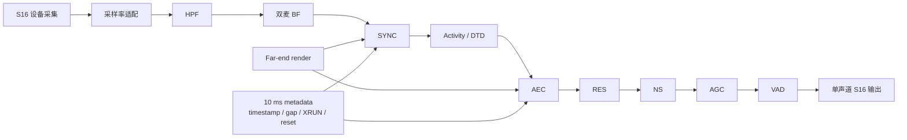
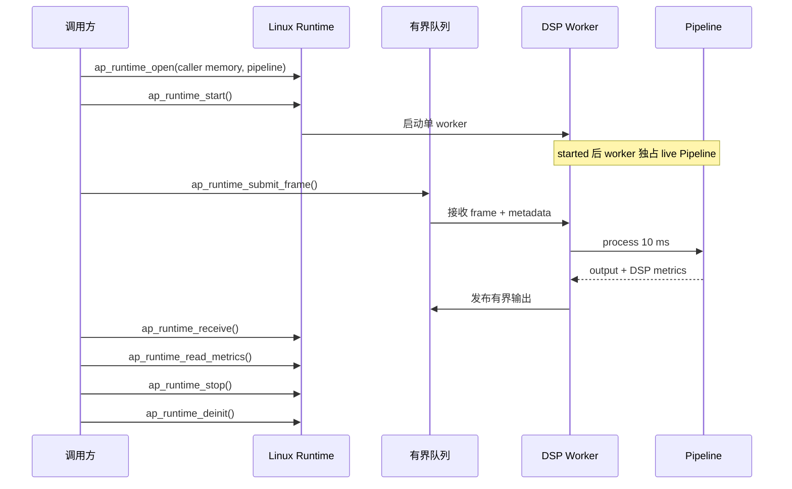
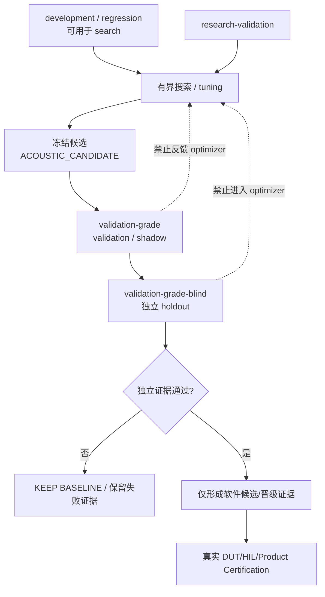
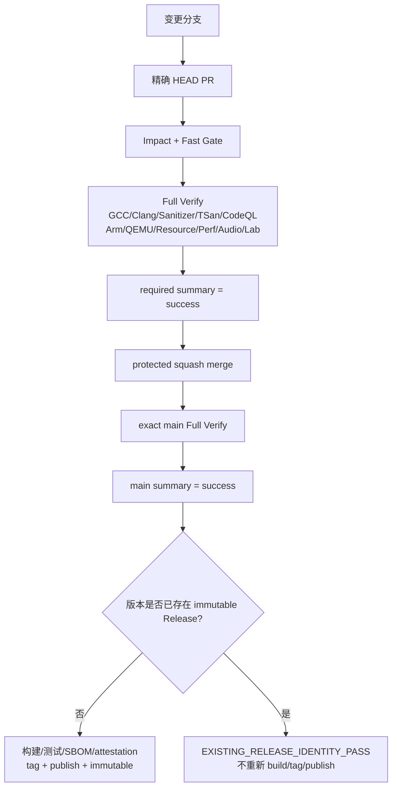
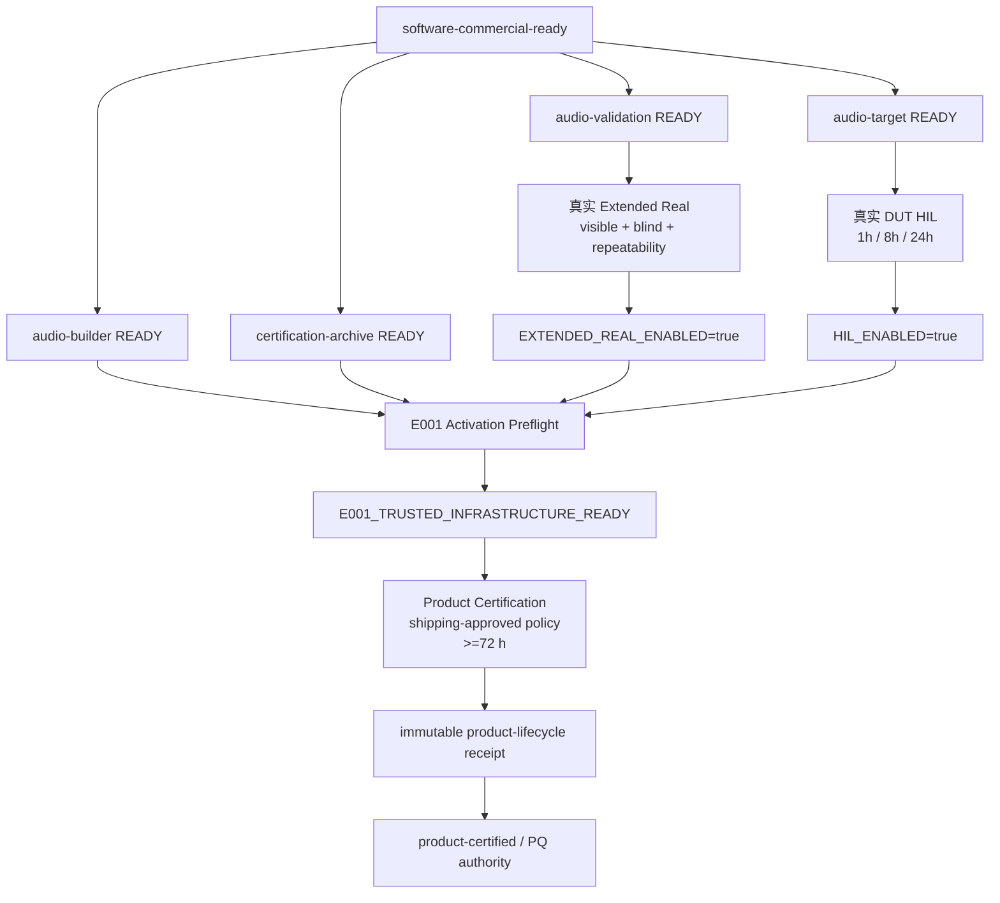
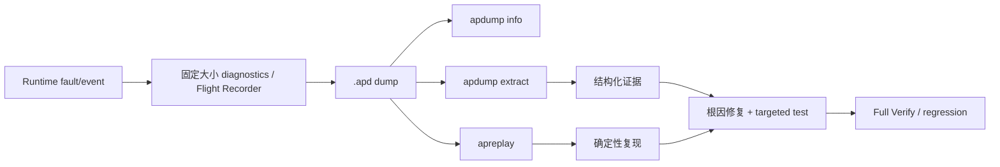
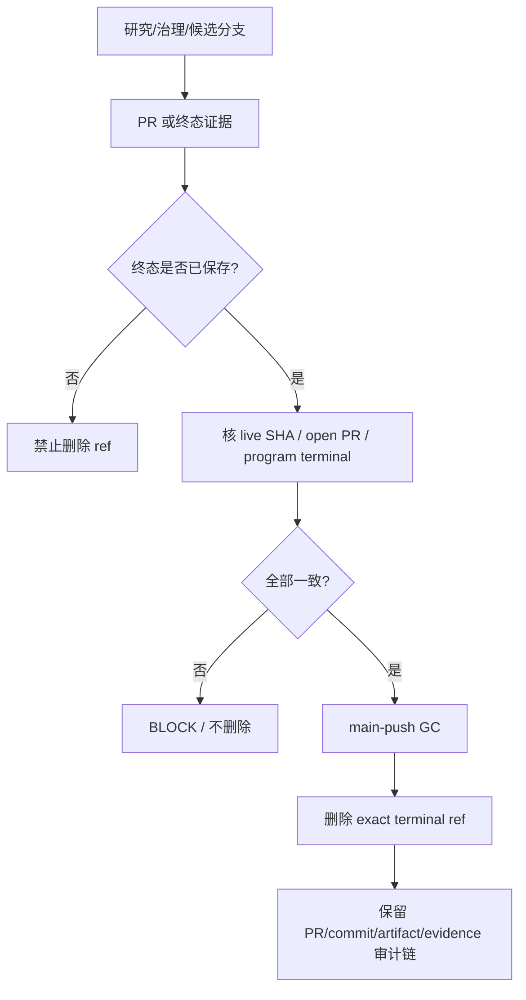

# 关键流程图（中文）

本页把仓库已经存在的机器契约画成可读流程图。流程图**不创建新的权限**；与 workflow、schema 或 `validation/authority.json` 冲突时，以机器契约为准。

## 1. 音频数据流

核心约束：固定 10 ms frame；同步 stage/core 不做 heap、文件/网络 I/O、mutex 或格式化日志；CPU 型号不进入算法依赖。

## 2. Runtime 所有权与线程

控制面不能绕过 worker 直接修改 started 状态下的 Pipeline；ownership/queue/counter 变更必须通过 TSan 契约。

## 3. 数据集自测、调参与晋级权限

关键规则：validation-grade/blind 不能用于挑参数；重复使用同一数据不是新的独立确认；任何搜索都不能自动改 shipping defaults。

## 4. PR → main → Release

Release-neutral descendant 不应为了治理/文档变化制造新 SemVer；release-bearing 变化必须按 SemVer/CHANGELOG 契约发布。

## 5. 软件商用就绪 → 真实产品认证

`READY` 只是基础设施 readiness，不是 HIL/PQ/Product Certification PASS。Hosted CI、QEMU、公开数据或较短 soak 均不能替代最终物理证据。

## 6. Dump / Replay 故障闭环

Realtime worker 不执行 dump 文件 I/O；dump 可能包含用户语音，产品必须定义访问控制、保留周期和安全删除。

## 7. 分支/证据生命周期（branch lifecycle）

任何 branch GC 都不获得 DSP、HIL、Release、Product Certification 或 PQ 权限。
